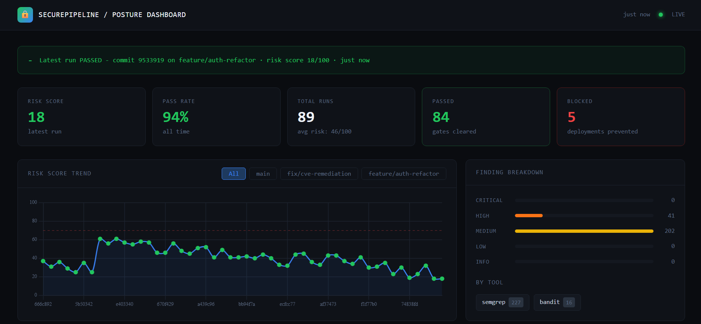

# SecurePipeline - DevSecOps Reference Architecture

A production-grade CI/CD pipeline with integrated AppSec gates and a real-time security posture dashboard. Built as a portfolio reference for enterprise DevSecOps practices.

## User Interface



## What This Demonstrates

| Gate | Tool | Blocks On |
|------|------|-----------|
| Secrets scanning | Gitleaks | Any hardcoded credential |
| Dependency CVEs | Safety (Python) + npm audit | CVSS >= 7.0 (High/Critical) |
| SAST | Bandit + Semgrep | High-severity findings |
| Container scanning | Trivy | Critical CVEs in image layers |
| Policy gate | OPA (Open Policy Agent) | Any critical aggregate finding |

The OPA policy gate acts as the final arbiter - it ingests findings from all prior stages and enforces a unified pass/fail decision with full audit trail.

## Architecture

```
+-----------------------------------------------------------------+
|                        GitHub Actions                           |
|                                                                 |
|  +----------+  +----------+  +----------+  +--------------+  |
|  | Secrets  |  |   Deps   |  |   SAST   |  |  Container   |  |
|  | Scanning |  |  (CVEs)  |  | Analysis |  |   Scanning   |  |
|  | Gitleaks |  |  Safety  |  |  Bandit  |  |    Trivy     |  |
|  |          |  | npm audit|  | Semgrep  |  |              |  |
|  `----+-----+  `----+-----+  `----+-----+  `------+-------+  |
|       |             |             |                |           |
|       `-------------+-------------+----------------+           |
|                              |                                  |
|                    +---------v----------+                      |
|                    |   OPA Policy Gate  |                      |
|                    |  Aggregates all    |                      |
|                    |  findings -> pass   |                      |
|                    |  or block deploy   |                      |
|                    `---------+----------+                      |
|                              |                                  |
|               +--------------+--------------+                  |
|               v              v              v                  |
|          - Deploy      - Block       📊 Report               |
`-----------------------------------------------------------------+
                              |
                    +---------v----------+
                    |  Posture Dashboard  |
                    |  TypeScript/Node   |
                    |  Trend charts      |
                    |  Finding history   |
                    `--------------------+
```

## Project Structure

```
devsecops-pipeline/
|-- .github/workflows/
|   |-- devsecops.yml        # Main pipeline (all gates)
|   `-- scheduled-audit.yml  # Nightly dependency audit
|-- target-app/              # Intentionally imperfect Python app
|   |-- src/
|   |   |-- app.py           # Flask API (has some findings to catch)
|   |   `-- db.py            # Database layer
|   |-- tests/
|   |   `-- test_app.py
|   |-- requirements.txt
|   `-- Dockerfile
|-- scanner/
|   |-- aggregate.py         # Collects all scan outputs -> unified JSON
|   |-- opa_input.py         # Formats findings for OPA
|   `-- semgrep_rules.yml    # Custom rules
|-- opa/
|   `-- policies/
|       `-- devsecops.rego   # OPA policy (the gate logic)
|-- dashboard/               # TypeScript/Node.js posture dashboard
|   |-- src/
|   |   |-- server.ts        # Express API + report ingestion
|   |   |-- components/      # UI components
|   |   `-- lib/             # Data layer
|   |-- public/
|   |   `-- index.html       # Dashboard UI
|   `-- package.json
|-- scripts/
|   |-- run_local.sh         # Run full pipeline locally
|   `-- seed_history.py      # Seed demo trend data
`-- reports/                 # Scan output artifacts (gitignored)
```

## Quickstart

### Run the pipeline locally

```bash
# Install Python deps
pip install -r target-app/requirements.txt
pip install bandit safety semgrep gitleaks

# Run all gates
./scripts/run_local.sh

# Start dashboard
cd dashboard && npm install && npm run dev
# Open http://localhost:3000
```

### GitHub Actions

Push to any branch - the pipeline triggers automatically. Findings are uploaded as workflow artifacts and posted to the dashboard endpoint on success.

## OPA Policy Logic

The gate evaluates a JSON findings report and enforces:

1. **Zero critical CVEs** in dependencies or container layers
2. **Zero high/critical SAST findings** after deduplication  
3. **Zero secrets** of any severity
4. **Aggregate risk score < 70** (weighted formula)

Any violation produces a structured denial with the specific rule that fired, enabling targeted remediation rather than a generic "pipeline failed."

## Dashboard

The TypeScript dashboard persists scan reports to a local JSON store and renders:

- **Posture trend line** - risk score over time
- **Finding breakdown** - by tool, severity, category
- **Gate history** - pass/fail per commit
- **Hotspot table** - files with repeated findings